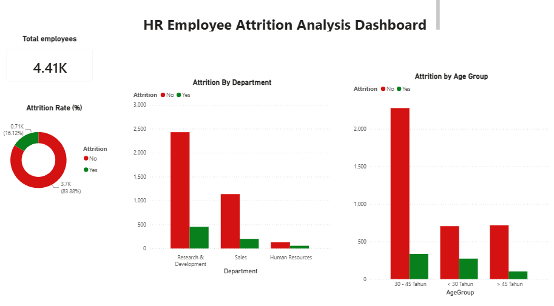

# 📊 HR Employee Attrition Analysis Dashboard

An interactive Power BI dashboard designed to analyze employee turnover rates across departments and age groups, providing actionable insights for HR management to improve retention strategies.

---

## 🖼️ Dashboard Preview

---

## 📌 Executive Summary

* **Total Workforce:** **4.41K** active employee records analyzed.
* **Key Department Insight:** The **Research & Development (R&D)** department shows the highest absolute count of employee attrition, followed by Sales.
* **Demographic Vulnerability:** The **30–45 years** age group accounts for the largest overall number of departures, while employees under **30 years** show a high relative attrition rate compared to their total team size.
* **Retention Stability:** Employees aged **> 45 years** demonstrate the highest stability and lowest attrition across all categories.

---

## 💡 Strategic HR Recommendations

1. **Targeted Interventions in R&D:** Conduct stay-interviews and re-evaluate workload distribution and career progression within R&D.
2. **Early-Career Retention (< 30 Years):** Strengthen onboarding programs and define clear 2-year growth pathways to reduce early turnover.
3. **Mid-Career Work-Life Balance (30–45 Years):** Implement flexible working arrangements, leadership training, and retention incentives for mid-level staff.

---

## 🛠️ Tools & Technologies

* **Data Visualization & BI:** Microsoft Power BI (DAX, Data Modeling)
* **Dataset:** HR Employee Attrition Data (`.csv`)
